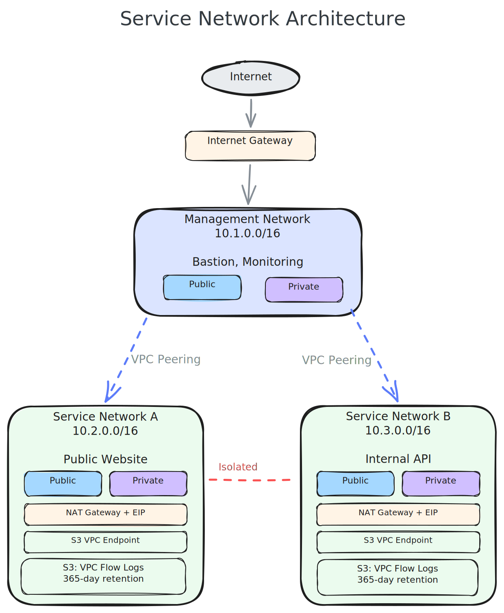

# terraform-aws-service-network

[](https://infrahouse.com/contact)
[](https://infrahouse.github.io/terraform-aws-service-network/)
[](https://registry.terraform.io/modules/infrahouse/service-network/aws/latest)
[](https://github.com/infrahouse/terraform-aws-service-network/releases/latest)
[](https://aws.amazon.com/vpc/)
[](https://github.com/infrahouse/terraform-aws-service-network/actions/workflows/checkov.yml)
[](LICENSE)



A Terraform module that creates isolated AWS VPC "service networks" with an optional
management network peering topology. Each service network is an island where instances
can communicate internally and with the outside world, but not with other service networks.

## Features

- Creates a VPC with configurable CIDR block and DNS settings
- Dynamic subnet creation with per-subnet control over public IP mapping, NAT gateways, and traffic forwarding
- Hub-and-spoke topology: service networks automatically peer with a management VPC
- VPC Flow Logs to S3 with configurable retention (defaults to 365 days for ISO/SOC compliance)
- S3 gateway endpoint for private S3 access
- Restrictive default security group (configurable)
- Internet Gateway and optional per-subnet NAT Gateways with Elastic IPs

## Quick Start

```hcl
module "network" {
  source  = "registry.infrahouse.com/infrahouse/service-network/aws"
  version = "3.2.2"

  environment           = "production"
  service_name          = "my-service"
  vpc_cidr_block        = "10.1.0.0/16"
  management_cidr_block = "10.1.0.0/16"
  subnets = [
    {
      cidr                    = "10.1.0.0/24"
      availability_zone       = "us-west-2a"
      map_public_ip_on_launch = true
      create_nat              = true
    },
    {
      cidr              = "10.1.1.0/24"
      availability_zone = "us-west-2b"
      forward_to        = "10.1.0.0/24"
    }
  ]
}
```

## Documentation

Full documentation is available at
[infrahouse.github.io/terraform-aws-service-network](https://infrahouse.github.io/terraform-aws-service-network/).

## Usage

### Management network

A management network is detected when `management_cidr_block == vpc_cidr_block`.
It acts as a hub that can communicate with all service networks.

```hcl
module "management" {
  source  = "registry.infrahouse.com/infrahouse/service-network/aws"
  version = "3.2.2"

  environment           = "production"
  service_name          = "management"
  vpc_cidr_block        = "10.1.0.0/16"
  management_cidr_block = "10.1.0.0/16"
  subnets = [
    {
      cidr                    = "10.1.0.0/24"
      availability_zone       = "us-west-2a"
      map_public_ip_on_launch = true
      create_nat              = true
    },
    {
      cidr              = "10.1.1.0/24"
      availability_zone = "us-west-2b"
      forward_to        = "10.1.0.0/24"
    },
    {
      cidr              = "10.1.2.0/24"
      availability_zone = "us-west-2c"
      forward_to        = "10.1.0.0/24"
    }
  ]
}
```

### Service network

Service networks (where `management_cidr_block != vpc_cidr_block`) automatically
peer with the management VPC, creating a hub-and-spoke topology where service
networks are isolated from each other but can communicate through the management network.

```hcl
module "website" {
  source  = "registry.infrahouse.com/infrahouse/service-network/aws"
  version = "3.2.2"

  environment           = "production"
  service_name          = "website"
  vpc_cidr_block        = "10.3.0.0/16"
  management_cidr_block = "10.1.0.0/16"
  subnets = [
    {
      cidr                    = "10.3.0.0/24"
      availability_zone       = "us-west-2a"
      map_public_ip_on_launch = true
      create_nat              = true
    },
    {
      cidr              = "10.3.1.0/24"
      availability_zone = "us-west-2b"
      forward_to        = "10.3.0.0/24"
      tags = {
        region = "us-west-2b"
      }
    }
  ]
}
```

## Examples

See the [test_data/service_network](test_data/service_network/) directory for
a working example used in integration tests.

<!-- BEGIN_TF_DOCS -->

## Requirements

| Name | Version |
|------|---------|
| <a name="requirement_aws"></a> [aws](#requirement\_aws) | >= 5.11, < 7.0 |

## Providers

| Name | Version |
|------|---------|
| <a name="provider_aws"></a> [aws](#provider\_aws) | >= 5.11, < 7.0 |

## Modules

No modules.

## Resources

| Name | Type |
|------|------|
| [aws_default_route_table.default](https://registry.terraform.io/providers/hashicorp/aws/latest/docs/resources/default_route_table) | resource |
| [aws_default_security_group.default](https://registry.terraform.io/providers/hashicorp/aws/latest/docs/resources/default_security_group) | resource |
| [aws_eip.nat_eip](https://registry.terraform.io/providers/hashicorp/aws/latest/docs/resources/eip) | resource |
| [aws_flow_log.vpc](https://registry.terraform.io/providers/hashicorp/aws/latest/docs/resources/flow_log) | resource |
| [aws_internet_gateway.ig](https://registry.terraform.io/providers/hashicorp/aws/latest/docs/resources/internet_gateway) | resource |
| [aws_nat_gateway.nat_gw](https://registry.terraform.io/providers/hashicorp/aws/latest/docs/resources/nat_gateway) | resource |
| [aws_route.default_main](https://registry.terraform.io/providers/hashicorp/aws/latest/docs/resources/route) | resource |
| [aws_route.route_from_me_to_mgmt](https://registry.terraform.io/providers/hashicorp/aws/latest/docs/resources/route) | resource |
| [aws_route.route_from_mgmt_to_me](https://registry.terraform.io/providers/hashicorp/aws/latest/docs/resources/route) | resource |
| [aws_route.subnet_private](https://registry.terraform.io/providers/hashicorp/aws/latest/docs/resources/route) | resource |
| [aws_route.subnet_public](https://registry.terraform.io/providers/hashicorp/aws/latest/docs/resources/route) | resource |
| [aws_route_table.all](https://registry.terraform.io/providers/hashicorp/aws/latest/docs/resources/route_table) | resource |
| [aws_route_table_association.all](https://registry.terraform.io/providers/hashicorp/aws/latest/docs/resources/route_table_association) | resource |
| [aws_s3_bucket.vpc_flow_logs](https://registry.terraform.io/providers/hashicorp/aws/latest/docs/resources/s3_bucket) | resource |
| [aws_s3_bucket_lifecycle_configuration.vpc_flow_logs](https://registry.terraform.io/providers/hashicorp/aws/latest/docs/resources/s3_bucket_lifecycle_configuration) | resource |
| [aws_s3_bucket_policy.vpc_flow_logs](https://registry.terraform.io/providers/hashicorp/aws/latest/docs/resources/s3_bucket_policy) | resource |
| [aws_s3_bucket_public_access_block.public_access](https://registry.terraform.io/providers/hashicorp/aws/latest/docs/resources/s3_bucket_public_access_block) | resource |
| [aws_s3_bucket_server_side_encryption_configuration.default](https://registry.terraform.io/providers/hashicorp/aws/latest/docs/resources/s3_bucket_server_side_encryption_configuration) | resource |
| [aws_s3_bucket_versioning.enabled](https://registry.terraform.io/providers/hashicorp/aws/latest/docs/resources/s3_bucket_versioning) | resource |
| [aws_subnet.all](https://registry.terraform.io/providers/hashicorp/aws/latest/docs/resources/subnet) | resource |
| [aws_vpc.vpc](https://registry.terraform.io/providers/hashicorp/aws/latest/docs/resources/vpc) | resource |
| [aws_vpc_endpoint.s3](https://registry.terraform.io/providers/hashicorp/aws/latest/docs/resources/vpc_endpoint) | resource |
| [aws_vpc_endpoint_route_table_association.s3](https://registry.terraform.io/providers/hashicorp/aws/latest/docs/resources/vpc_endpoint_route_table_association) | resource |
| [aws_vpc_peering_connection.link_to_management](https://registry.terraform.io/providers/hashicorp/aws/latest/docs/resources/vpc_peering_connection) | resource |
| [aws_vpc_security_group_egress_rule.default](https://registry.terraform.io/providers/hashicorp/aws/latest/docs/resources/vpc_security_group_egress_rule) | resource |
| [aws_vpc_security_group_ingress_rule.default](https://registry.terraform.io/providers/hashicorp/aws/latest/docs/resources/vpc_security_group_ingress_rule) | resource |
| [aws_caller_identity.current](https://registry.terraform.io/providers/hashicorp/aws/latest/docs/data-sources/caller_identity) | data source |
| [aws_iam_policy_document.vpc_flow_logs](https://registry.terraform.io/providers/hashicorp/aws/latest/docs/data-sources/iam_policy_document) | data source |
| [aws_region.current](https://registry.terraform.io/providers/hashicorp/aws/latest/docs/data-sources/region) | data source |
| [aws_route_tables.mgmt_route_tables](https://registry.terraform.io/providers/hashicorp/aws/latest/docs/data-sources/route_tables) | data source |
| [aws_vpc.management_vpc](https://registry.terraform.io/providers/hashicorp/aws/latest/docs/data-sources/vpc) | data source |

## Inputs

| Name | Description | Type | Default | Required |
|------|-------------|------|---------|:--------:|
| <a name="input_default_security_group_cidr"></a> [default\_security\_group\_cidr](#input\_default\_security\_group\_cidr) | CIDR block for the default security group rules when restrict\_all\_traffic is false.<br/>If null, defaults to the VPC CIDR block. | `string` | `null` | no |
| <a name="input_enable_dns_hostnames"></a> [enable\_dns\_hostnames](#input\_enable\_dns\_hostnames) | A boolean flag to enable/disable DNS hostnames in the VPC. Defaults true. | `bool` | `true` | no |
| <a name="input_enable_dns_support"></a> [enable\_dns\_support](#input\_enable\_dns\_support) | A boolean flag to enable/disable DNS support in the VPC. Defaults true. | `bool` | `true` | no |
| <a name="input_enable_resource_name_dns_a_record_on_launch"></a> [enable\_resource\_name\_dns\_a\_record\_on\_launch](#input\_enable\_resource\_name\_dns\_a\_record\_on\_launch) | Indicates whether to respond to DNS queries for instance hostnames with DNS A records. | `bool` | `false` | no |
| <a name="input_enable_vpc_flow_logs"></a> [enable\_vpc\_flow\_logs](#input\_enable\_vpc\_flow\_logs) | Whether to enable VPC Flow Logs. Default, true. | `bool` | `true` | no |
| <a name="input_environment"></a> [environment](#input\_environment) | Name of environment | `string` | n/a | yes |
| <a name="input_flow_logs_force_destroy"></a> [flow\_logs\_force\_destroy](#input\_flow\_logs\_force\_destroy) | Whether to force destroy the VPC flow logs S3 bucket and all its contents on deletion. | `bool` | `false` | no |
| <a name="input_management_cidr_block"></a> [management\_cidr\_block](#input\_management\_cidr\_block) | Management VPC cidr block | `string` | n/a | yes |
| <a name="input_restrict_all_traffic"></a> [restrict\_all\_traffic](#input\_restrict\_all\_traffic) | Whether the default security group should deny all traffic | `bool` | `true` | no |
| <a name="input_service_name"></a> [service\_name](#input\_service\_name) | Descriptive name of a service that will use this VPC | `string` | n/a | yes |
| <a name="input_subnets"></a> [subnets](#input\_subnets) | List of subnets in the VPC | <pre>list(<br/>    object(<br/>      {<br/>        cidr                    = string<br/>        availability_zone       = optional(string, null)<br/>        availability-zone       = optional(string, null) # Deprecated, use availability_zone<br/>        map_public_ip_on_launch = optional(bool, false)<br/>        create_nat              = optional(bool, false)<br/>        forward_to              = optional(string, null)<br/>        tags                    = optional(map(string), {})<br/>      }<br/>    )<br/>  )</pre> | `[]` | no |
| <a name="input_tags"></a> [tags](#input\_tags) | Tags to apply to each resource | `map(string)` | `{}` | no |
| <a name="input_vpc_cidr_block"></a> [vpc\_cidr\_block](#input\_vpc\_cidr\_block) | Block of IP addresses used for this VPC | `string` | n/a | yes |
| <a name="input_vpc_flow_retention_days"></a> [vpc\_flow\_retention\_days](#input\_vpc\_flow\_retention\_days) | Retention period for VPC flow logs in S3 bucket. | `number` | `365` | no |

## Outputs

| Name | Description |
|------|-------------|
| <a name="output_internet_gateway_id"></a> [internet\_gateway\_id](#output\_internet\_gateway\_id) | The ID of the Internet Gateway attached to the VPC |
| <a name="output_is_management_network"></a> [is\_management\_network](#output\_is\_management\_network) | Boolean indicating whether this is a management network |
| <a name="output_management_cidr_block"></a> [management\_cidr\_block](#output\_management\_cidr\_block) | The CIDR block of the management VPC |
| <a name="output_route_table_all_ids"></a> [route\_table\_all\_ids](#output\_route\_table\_all\_ids) | List of IDs of all route tables |
| <a name="output_subnet_all_ids"></a> [subnet\_all\_ids](#output\_subnet\_all\_ids) | List of IDs of all subnets |
| <a name="output_subnet_private_ids"></a> [subnet\_private\_ids](#output\_subnet\_private\_ids) | List of IDs of private subnets |
| <a name="output_subnet_public_ids"></a> [subnet\_public\_ids](#output\_subnet\_public\_ids) | List of IDs of public subnets |
| <a name="output_vpc_cidr_block"></a> [vpc\_cidr\_block](#output\_vpc\_cidr\_block) | The CIDR block of the VPC |
| <a name="output_vpc_flow_bucket_name"></a> [vpc\_flow\_bucket\_name](#output\_vpc\_flow\_bucket\_name) | S3 bucket name with VPC Flow logs if enabled |
| <a name="output_vpc_id"></a> [vpc\_id](#output\_vpc\_id) | The ID of the VPC |
<!-- END_TF_DOCS -->

## Contributing

See [CONTRIBUTING.md](CONTRIBUTING.md) for guidelines.

## License

[Apache 2.0](LICENSE)
