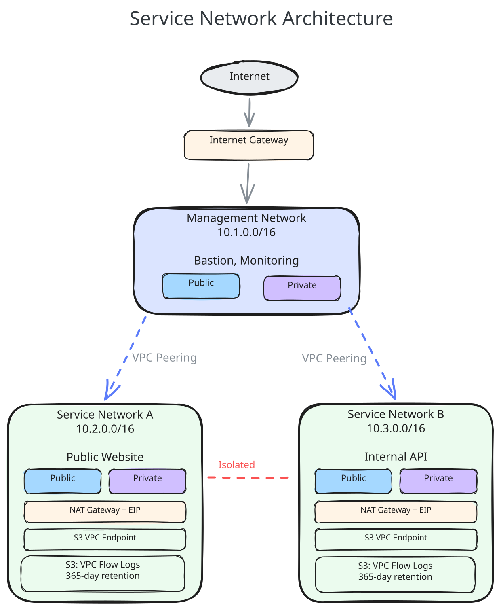
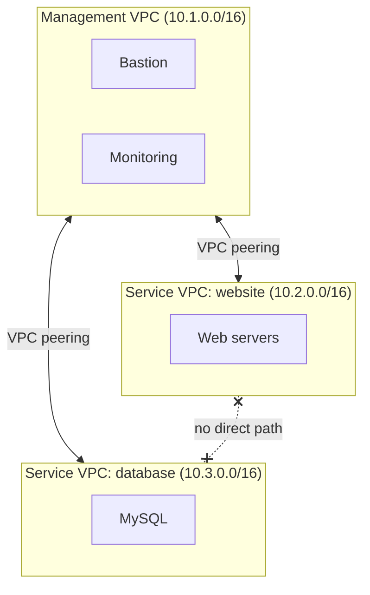

# Architecture

This document explains how the service-network module works internally.

## Overview

The module creates one VPC per invocation. The kind of network it builds is determined by
comparing two input variables:

- `management_cidr_block == vpc_cidr_block` — this is the **management network** (the hub)
- `management_cidr_block != vpc_cidr_block` — this is a **service network** (a spoke) that
  automatically peers with the management VPC

## Hub-and-Spoke Topology

Service networks are isolated from each other by design — there is no route between two
service VPCs. Shared infrastructure (bastion hosts, monitoring, CI runners) lives in the
management network, which can reach every spoke.

## Components

Each component lives in its own Terraform file.

### VPC (`main.tf`)

The `aws_vpc` resource with configurable DNS support and DNS hostnames. The VPC is tagged
with `management = true/false` so it can be identified later, and uses
`create_before_destroy` so CIDR changes do not leave dependent networks without a hub.

### Subnets (`subnets.tf`)

Subnets are created with `for_each` over the `subnets` input variable, keyed by CIDR.
A subnet is **public** when `map_public_ip_on_launch = true`, otherwise **private**.
Per-subnet tags are merged with the module-wide tags.

### Routing (`routing.tf`)

Every subnet gets its own route table:

- The VPC's default route table sends `0.0.0.0/0` to the Internet Gateway.
- Public subnets get a `0.0.0.0/0` route to the Internet Gateway.
- Private subnets with `forward_to` set get a `0.0.0.0/0` route to the NAT Gateway in the
  subnet named by `forward_to`.
- Private subnets without `forward_to` get no internet route at all.

For service networks, the module additionally creates peering routes in **both**
directions: a route to `management_cidr_block` in every subnet's route table, and a route
to this VPC's CIDR in every route table of the management VPC.

### Gateways (`gateways.tf`)

An Internet Gateway is always created. A NAT Gateway with an Elastic IP is created in
every subnet that sets `create_nat = true`. The subnet hosting a NAT Gateway must be
public (`map_public_ip_on_launch = true`), otherwise the NAT Gateway has no path to the
internet.

### VPC Peering (`peering.tf`)

Service networks look up the management VPC by its CIDR block with a data source and
create an auto-accepted `aws_vpc_peering_connection` to it. This requires the management
VPC to exist in the same account and region before a service network is applied.

### VPC Flow Logs (`vpc_flow_logs.tf`)

Flow logs for the whole VPC are delivered to a dedicated S3 bucket. The bucket:

- denies non-TLS access via bucket policy,
- has versioning enabled,
- expires log objects after `vpc_flow_retention_days` (365 by default, per ISO/SOC
  requirements).

### Cross-Region Replication (`vpc_flow_logs_replication.tf`)

The flow logs bucket is replicated to a second bucket in `replication_region` for
disaster recovery. Replicated objects are stored in the `STANDARD_IA` storage class and
expire on the same schedule as the source. A dedicated IAM role grants S3 the minimum
permissions needed for replication. `replication_region` must differ from the region the
module is deployed in — this is enforced by a precondition.

### S3 Gateway Endpoint (`vpc_endpoint.tf`)

A gateway-type VPC endpoint for S3 is created and associated with every subnet's route
table, so S3 traffic (including flow log delivery) stays on the AWS network.

### Default Security Group (`security_groups.tf`)

By default (`restrict_all_traffic = true`) the VPC's default security group has no rules,
denying all traffic. Setting `restrict_all_traffic = false` allows all traffic within the
VPC CIDR (or `default_security_group_cidr` if set).

## Route Tables in Detail

For a private subnet `10.2.1.0/24` in a service network `10.2.0.0/16` with
`forward_to = "10.2.0.0/24"` and a management network `10.1.0.0/16`, the route table
looks like this:

| Destination            | Target                 | Purpose                    |
|------------------------|------------------------|----------------------------|
| `10.2.0.0/16`          | local                  | VPC-internal traffic       |
| `0.0.0.0/0`            | NAT Gateway            | Outbound internet access   |
| `10.1.0.0/16`          | VPC peering connection | Management network traffic |
| S3 prefix list         | S3 gateway endpoint    | Private S3 access          |

The same subnet in a management network would have no peering route; instead, every route
table in the management VPC receives routes to each service network's CIDR through the
respective peering connection.
